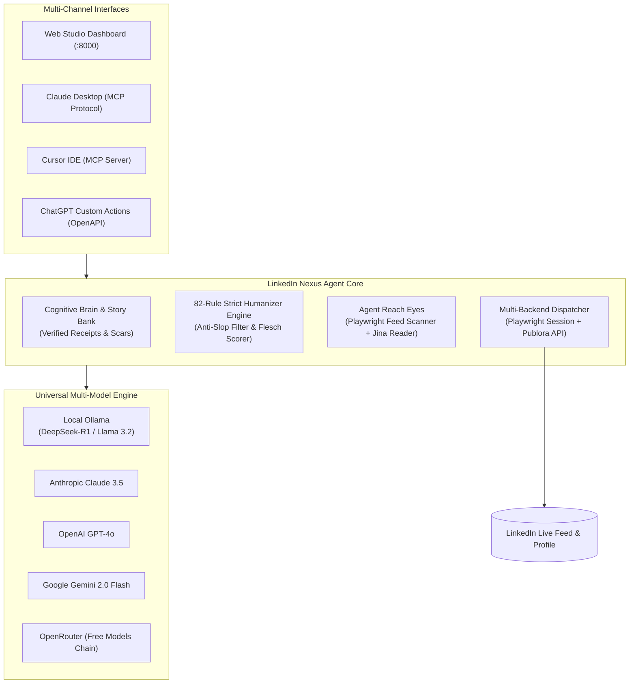

# 🚀 LinkedIn Nexus Agent — Autonomous Open-Source LinkedIn Studio & Reach Engine

<p align="center">
  <a href="https://github.com/muhdfaisalwork-gif/linkedin-agent/actions"></a>
  <a href="https://modelcontextprotocol.io/"></a>
  <a href="https://ollama.com/"></a>
  <a href="https://openrouter.ai/"></a>
  <a href="https://playwright.dev/"></a>
  <a href="#license"></a>
</p>

<p align="center">
  <b>The #1 Free, Open-Source Alternative to Taplio & AuthoredUp.</b><br>
  Equipped with an evolving <b>Cognitive Brain</b>, an <b>82-Rule Humanizer Gate</b>, <b>Agent Reach Eyes</b>, and native <b>Claude / Cursor MCP Server</b> support. Runs 100% locally with Ollama (zero API fees) or multi-model cloud providers.
</p>

---

## ⚡ Why LinkedIn Nexus Agent?

Most AI tools generate detectable, robotic LinkedIn slop (*"In today's fast-paced digital landscape, delving into transformative ecosystems..."*). The 2026 LinkedIn algorithm aggressively penalizes this with **-34% to -65% distribution reach**.

**LinkedIn Nexus Agent solves this at the architecture level:**
1. **82-Rule Humanizer Guardrail**: Programmatically eliminates all 82 AI tells, banned buzzwords, robotic reveal bridges, and artificial staccato.
2. **Cognitive Brain & Career Story Bank**: Stores your real ventures, numbers, latency benchmarks, and scars. Never invents fake case studies.
3. **Agent Reach Eyes**: Autonomous visual DOM & Jina Reader scanner that observes trending feed posts and extracts contrarian founder commentary angles.
4. **Universal Multi-Model Freedom**: Switch instantly between **Local Ollama** (100% private & free), **Anthropic Claude**, **OpenAI GPT-4o**, **Google Gemini**, or **Free OpenRouter models**.
5. **Claude Desktop & Cursor MCP Server**: Chat with your agent directly inside Claude Desktop, Cursor, or ChatGPT to draft, schedule, and publish posts.

---

## 📊 Comparison: LinkedIn Nexus Agent vs. Paid SaaS

| Feature | **LinkedIn Nexus Agent** | **Taplio** | **AuthoredUp** | **Jasper / Copy.ai** |
| :--- | :---: | :---: | :---: | :---: |
| **Price** | **$0 / month (Free & Open Source)** | $65 – $199 / mo | $20 – $40 / mo | $49 – $125 / mo |
| **Local Offline AI (Ollama)** | **✓ Yes (100% private)** | ❌ No | ❌ No | ❌ No |
| **82-Rule Anti-Slop Humanizer** | **✓ Yes (Strict Programmatic)** | ❌ Generic AI | ❌ Formatting only | ❌ Generic AI |
| **Cognitive Brain & Story Bank** | **✓ Yes (Verified Receipts)** | ❌ No memory | ❌ No memory | ❌ Generic personas |
| **Claude Desktop / Cursor MCP** | **✓ Native JSON-RPC 2.0** | ❌ No | ❌ No | ❌ No |
| **Direct Session Cookie (`li_at`)** | **✓ Yes (< 1s Instant Sync)** | Chrome Ext only | Chrome Ext only | ❌ No |
| **Autonomous Agent Reach Eyes** | **✓ Yes (DOM + Multimodal Vision)**| ❌ No | ❌ No | ❌ No |
| **Data Privacy** | **100% Local SQLite on your machine**| Stored in Cloud | Stored in Cloud | Stored in Cloud |

---

## 🏗️ System Architecture



---

## 🚀 Quick Start (Up in < 2 Minutes)

### Option A: 1-Click Launch (Windows)
Double-click `launch.bat` in the repository root:
```cmd
launch.bat
```

### Option B: Terminal / uv (All Platforms)
```bash
# Clone the repository
git clone https://github.com/muhdfaisalwork-gif/linkedin-agent.git
cd linkedin-agent

# Install dependencies (using uv or standard pip)
pip install -r requirements.txt

# Launch Studio Server
python run.py
```
Open your browser to **http://localhost:8000**.

---

## 🔌 Connect to Claude Desktop or Cursor (MCP)

LinkedIn Nexus Agent ships with a certified **Model Context Protocol (MCP)** server:

### 1-Click Auto-Installer:
```bash
python scripts/install_mcp.py
```

### Manual Configuration (`claude_desktop_config.json`):
```json
{
  "mcpServers": {
    "linkedin-nexus": {
      "command": "python",
      "args": ["g:\\linkedin agent\\run_mcp.py"]
    }
  }
}
```

Now you can prompt Claude:
- *"Draft a high-engagement post on our 420ms order latency using hook formula F7."*
- *"Scan my LinkedIn feed and recommend 3 trending posts to comment on."*
- *"Audit my profile headline and about section."*

---

## 🦙 Run 100% Locally with Ollama (Zero Cost, Complete Privacy)

1. Install [Ollama](https://ollama.com/) and pull a model:
```bash
ollama run deepseek-r1:8b
# or
ollama run llama3.2:latest
```
2. In the Studio Dashboard, go to **Settings** → Select **Ollama (Local)**.
3. Everything (post writing, comment replying, profile optimization) now runs completely offline on your own GPU/CPU with **zero API keys and zero cost**.

---

## 🧪 Automated Test Suite (100% Pass Rate)

Run the automated test suite (61 tests covering rules, brain, reach, MCP, and multi-model routing):
```bash
python -m pytest
```

---

## 🤝 Contributing & Community

Contributions are warmly welcomed! Please read [CONTRIBUTING.md](CONTRIBUTING.md) and review [SECURITY.md](SECURITY.md).

1. Fork the Project
2. Create your Feature Branch (`git checkout -b feature/AmazingFeature`)
3. Commit your Changes (`git commit -m 'Add some AmazingFeature'`)
4. Push to the Branch (`git push origin feature/AmazingFeature`)
5. Open a Pull Request

---

## 📄 License
Distributed under the MIT License. See [LICENSE](LICENSE) for more information.
