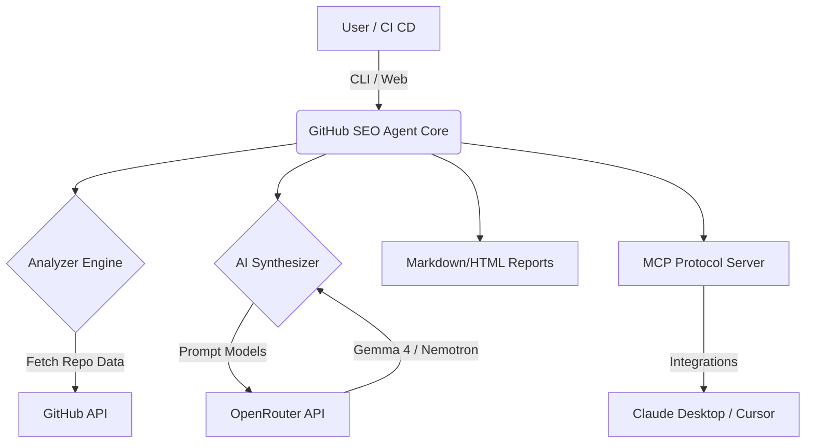

# 🔍 GitHub SEO Agent — Open-Source Repository Discoverability Engine

[](https://github.com/github-seo-agent/github-seo-agent/actions/workflows/ci.yml)
[](https://www.python.org/downloads/)
[](https://opensource.org/licenses/MIT)
[](https://openrouter.ai/)
[](https://modelcontextprotocol.io/)

> Maximize stars, forks, and organic search traffic for any GitHub repository. Free & open-source.

## ✨ Features

- 💯 **0-100 SEO Health Score** with actionable checklist
- 🤖 **AI-Powered Launch Copy** synthesis with free Gemma 4 & Nemotron models
- 🚀 **Multi-channel Launch Packs** (Hacker News, Reddit, Twitter/X, Product Hunt, GitHub Releases)
- 🏥 **Community Health File Generator** (100% GitHub profile score)
- 🔌 **Claude Desktop & Cursor MCP Server** integration
- 📊 **FastAPI Web Dashboard**
- 💻 **CLI Tool** for terminal-native workflows

## 🚀 Quick Start

```bash
git clone https://github.com/your-username/github-seo-agent.git
cd github-seo-agent
pip install -r requirements.txt
python github_seo_agent.py audit
```

## 💻 CLI Usage

```bash
# Run a full repository audit
python github_seo_agent.py audit

# Generate launch copy for a specific channel
python github_seo_agent.py launch --channel "Hacker News"

# Generate Community Health files
python github_seo_agent.py health-check --fix
```

## 🔌 MCP Integration

To add the GitHub SEO Agent to your Claude Desktop configuration:

```json
{
  "mcpServers": {
    "github-seo-agent": {
      "command": "python",
      "args": ["-m", "github_seo_agent.mcp"]
    }
  }
}
```

## 🏆 Showcase

Built to promote **LinkedIn Nexus Agent**. 
Check it out here: [https://github.com/muhdfaisalwork-gif/linkedin-agent](https://github.com/muhdfaisalwork-gif/linkedin-agent)

## 🏗️ Architecture



## ⚖️ GitHub SEO Agent vs Manual Optimization

| Feature | Manual Optimization | GitHub SEO Agent |
|---------|--------------------|------------------|
| Speed   | Hours / Days       | Seconds          |
| Cost    | High (Time)        | Free             |
| Quality | Varies             | High (AI-driven) |
| Score   | Manual checklist   | Automated 0-100  |

## 🤝 Contributing
Short contributing guide: fork, clone, install requirements, run tests, submit PR. See [CONTRIBUTING.md](CONTRIBUTING.md) for details.

## 📄 License
MIT License. See the [LICENSE](LICENSE) file for details.
